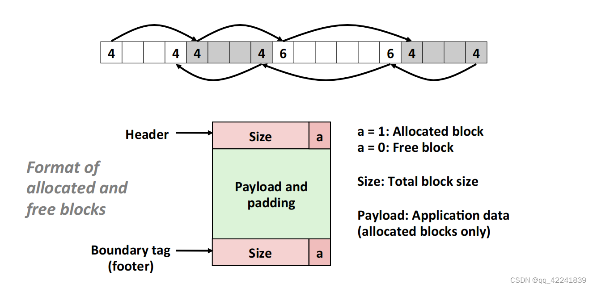
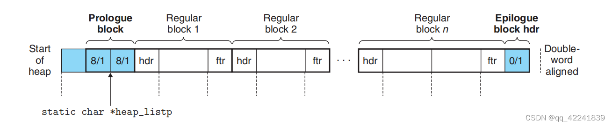

# 隐式空闲链表

来源：https://blog.csdn.net/qq_42241839/article/details/123697377

## 1. 思想

- 空闲块组织：隐式空闲链表
- 放置：首次适配（first fit） / 下一次适配（next fit）
- 分割：分割空闲块的前部使用。
- 合并：立即合并（immediate coalescing）

 

 

## 2. 优点和缺点

- 分配内存块 cost ：线性的 cost
- 释放内存块 cost ：与合并时间相加为常数时间
- 内存 cost ：依赖于放置策略：fist-fit / next-fit / best-fit

## 3. 函数设计原则

文件：`mm.c`

+ `int mm_init(void);`
  + 初始化对齐块，序言块，结尾块，并扩充堆块大小。

+ `void *mm_malloc(size_t size);`
  + 寻求合适的空闲块并分配，其间调用其他函数完成。

+ `void mm_free(void *prt);`
  + 修改内存块的分配位并合并内存块。

+ `void *mm_realloc(void *ptr, size_t size);`
  + 按要求分配内存块。

+ `static void *extend_heap(size_t size);`
  + 扩充堆空间，并返回指向结尾扩充后的空闲块的指针

+ `static void *find_fit(size_t size);`
  + 首次适配（first-fit）

+ `static void place(char *bp, size_t size);`
  + 负责在空闲块内放置数据，使其分割为分配块和空闲块，注意最小块的限制。

+ `static void *coalesce(void *bp);`
  + 合并空闲块，四种情况，返回指向该空闲块的指针。

+ `static void mm_printblock(int verbose, const char* func);`
  + 打印输出整个堆块的模型，方便DEBUG

## 4. 如何打印调试信息

```bash
./mdriver -V -f short1-bal.rep > out.txt
```

## 5. 首次匹配代码

`mm.c`

```c
/*
 * mm.c - The fastest, least memory-efficient malloc package.
 * 
 * In this naive approach, a block is allocated by simply incrementing
 * the brk pointer.  A block is pure payload. There are no headers or
 * footers.  Blocks are never coalesced or reused. Realloc is
 * implemented directly using mm_malloc and mm_free.
 *
 * NOTE TO STUDENTS: Replace this header comment with your own header
 * comment that gives a high level description of your solution.
 */
#include <stdio.h>
#include <stdlib.h>
#include <assert.h>
#include <unistd.h>
#include <string.h>

#include "mm.h"
#include "memlib.h"

/*********************************************************
 * NOTE TO STUDENTS: Before you do anything else, please
 * provide your team information in the following struct.
 ********************************************************/
team_t team = {
    /* Team name */
    "ateam",
    /* First member's full name */
    "Harry Bovik",
    /* First member's email address */
    "bovik@cs.cmu.edu",
    /* Second member's full name (leave blank if none) */
    "",
    /* Second member's email address (leave blank if none) */
    ""
};

#define VERBOSE 0
#ifdef DEBUG
#define VERBOSE 1
#endif


/* single word (4) or double word (8) alignment */
#define ALIGNMENT 8

/* rounds up to the nearest multiple of ALIGNMENT */  // 对 ALIGNMENT 倍数上取整的计算
#define ALIGN(size) (((size) + (ALIGNMENT-1)) & ~0x7)
#define SIZE_T_SIZE (ALIGN(sizeof(size_t)))

/* 自定义的宏，有便于操作常量和指针运算 */
#define WSIZE       4        //字、脚部或头部的大小（字节）
#define DSIZE       8        //双字大小（字节）
#define CHUNKSIZE  (1<<12)   //扩展堆时的默认大小
#define MINBLOCK (DSIZE + 2*WSIZE)

#define MAX(x, y)  ((x) > (y) ? (x) : (y))

#define PACK(size, alloc)  ((size) | (alloc))         //将 size 和 allocated bit 合并为一个字

#define GET(p)        (*(unsigned int *)(p))          //读地址p处的一个字
#define PUT(p, val)   (*(unsigned int *)(p) = (val))  //向地址p处写一个字

#define GET_SIZE(p)   (GET(p) & ~0x07)    //得到地址p处的 size
#define GET_ALLOC(p)  (GET(p) & 0x1)      //得到地址p处的 allocated bit
//block point --> bp指向有效载荷块指针
#define HDRP(bp)     ((char*)(bp) - WSIZE)                       //获得头部的地址
#define FTRP(bp)     ((char*)(bp) + GET_SIZE(HDRP(bp)) - DSIZE)  //获得脚部的地址, 与宏定义HDRP有耦合

#define NEXT_BLKP(bp)    ((char*)(bp) + GET_SIZE((char*)(bp) - WSIZE))  //计算后块的地址
#define PREV_BLKP(bp)    ((char*)(bp) - GET_SIZE((char*)(bp) - DSIZE))  //计算前块的地址

static void* heap_listp;    //指向序言块
/* private functions */
static void *extend_heap(size_t size);     //拓展堆块
static void *find_fit(size_t size);        //寻找空闲块
static void place(char *bp, size_t size);  //分割空闲块
static void *coalesce(void *bp);           //合并空闲块
//check
/*
static void mm_check(int verbose, const char* func);                 //heap consistency checker
static void mm_checkblock(int verbose, const char* func, void *bp);
static int mm_checkheap(int verbose, const char* func);
*/
static void mm_printblock(int verbose, const char* func);

/* 
 * mm_init - initialize the malloc package.
 */
//设立序言块、结尾块，以及序言块前的对齐块（4B），总共需要4个4B的空间
int mm_init(void)
{
    if ((heap_listp = mem_sbrk(4*WSIZE)) == (void*)-1) 
        return -1;
    PUT(heap_listp, 0);                     //堆起绐位置的对齐块，使bp对齐8字节
    PUT(heap_listp + 1*WSIZE, PACK(8, 1));  //序言块
    PUT(heap_listp + 2*WSIZE, PACK(8, 1));  //序言块
    PUT(heap_listp, PACK(0, 1));            //结尾块
    heap_listp += (2*WSIZE);     //小技巧：使heap_listp指向下一块, 即两个序主块中间

    if (extend_heap(CHUNKSIZE) == NULL)   //拓展堆块
        return -1;
    mm_printblock(VERBOSE, __func__);
    return 0;
}

static void *extend_heap(size_t size) {
    size_t asize;   
    void *bp;

    asize = ALIGN(size);
     //printf("extend %d\n", asize);
    if ((long)(bp = mem_sbrk(asize)) == -1)
        return NULL;

    PUT(HDRP(bp), PACK(asize, 0));          //HDRP(bp)指向原结尾块
    PUT(FTRP(bp), PACK(asize, 0));          
    PUT(HDRP(NEXT_BLKP(bp)), PACK(0, 1));   //新结尾块
    return coalesce(bp);
}

/* 
 * mm_malloc - Allocate a block by incrementing the brk pointer.
 *     Always allocate a block whose size is a multiple of the alignment.
 */
void *mm_malloc(size_t size)
{


    size_t asize;     //ajusted size
    size_t extendsize;  //若无适配块则拓展堆的大小
    void *bp = NULL;

    if (size == 0)    //无效的申请
        return NULL;

    asize = ALIGN(size + 2*WSIZE);
    
    if ((bp = find_fit(asize)) != NULL) {
        place((char *)bp, asize);
        mm_printblock(VERBOSE, __func__);
        return bp;
    }
    
    //无足够空间的空闲块用来分配
    extendsize = MAX(asize, CHUNKSIZE);
    if ((bp = extend_heap(extendsize)) == NULL) {
        return NULL;
    }    
    place(bp, asize);
    mm_printblock(VERBOSE, __func__);
    return bp;
}

//放置策略搜索   首次适配搜索
static void *find_fit(size_t size) {         
    void *curbp;
    for (curbp = heap_listp; GET_SIZE(HDRP(curbp)) > 0; curbp = NEXT_BLKP(curbp)) {
        if (!GET_ALLOC(HDRP(curbp)) && (GET_SIZE(HDRP(curbp)) >= size)) return curbp;
    }
    return NULL;    //未适配
} 

//分割空闲块
static void place(char *bp, size_t asize) {     //注意最小块的限制（16B == DSIZE + 2*WSIZE == MINBLOCK）
    size_t total_size = GET_SIZE(HDRP(bp));
    size_t remainder_size = total_size - asize;

    if (remainder_size >= MINBLOCK) {
        PUT(HDRP(bp), PACK(asize, 1));
        PUT(FTRP(bp), PACK(asize, 1));
        bp = NEXT_BLKP(bp);
        PUT(HDRP(bp), PACK(remainder_size, 0));
        PUT(FTRP(bp), PACK(remainder_size, 0));
    } else {          //没有已分配块或空闲块可以比最小块更小
        PUT(HDRP(bp), PACK(total_size, 1));
        PUT(FTRP(bp), PACK(total_size, 1));
    }
}

/*
 * mm_free - Freeing a block does nothing.
 */
void mm_free(void *ptr)
{
    size_t size = GET_SIZE(HDRP(ptr));
    PUT(HDRP(ptr), PACK(size, 0));
    PUT(FTRP(ptr), PACK(size, 0));
    coalesce(ptr);
    mm_printblock(VERBOSE, __func__);
}
/*
* coalesce - 合并内存块
*/
static void *coalesce(void *bp) {          
    int pre_alloc = GET_ALLOC(HDRP(PREV_BLKP(bp)));
    int post_alloc = GET_ALLOC(HDRP(NEXT_BLKP(bp)));
    size_t size = GET_SIZE(HDRP(bp));

    if (pre_alloc && post_alloc) {
        return bp;
    } else if (pre_alloc && !post_alloc) {   //与后块合并
        size += GET_SIZE(HDRP(NEXT_BLKP(bp)));
    } else if (!pre_alloc && post_alloc) {   //与前块合并
        size += GET_SIZE(HDRP(PREV_BLKP(bp)));
        bp = PREV_BLKP(bp);
    } else {  //前后块都合并
        size += GET_SIZE(HDRP(PREV_BLKP(bp))) + GET_SIZE(FTRP(NEXT_BLKP(bp)));
        bp = PREV_BLKP(bp);
    }
    PUT(HDRP(bp), PACK(size, 0));
    PUT(FTRP(bp), PACK(size, 0));     //FTRP()与GET_SIZE()有耦合，故此时所用的SIZE已经改变

    return bp;
}

/*
 * mm_realloc - Implemented simply in terms of mm_malloc and mm_free
 */
void *mm_realloc(void *ptr, size_t size)
{
    size_t old_size, new_size, extendsize;
    void *old_ptr, *new_ptr;

    if (ptr == NULL) {
        return mm_malloc(size);
    }
    if (size == 0) {
        mm_free(ptr);
        return NULL;
    }

    new_size = ALIGN(size + 2*WSIZE);
    old_size = GET_SIZE(HDRP(ptr));
    old_ptr = ptr;
    if (old_size >= new_size) {
        if (old_size - new_size >= MINBLOCK) {  //分割内存块
            place(old_ptr, new_size);
            mm_printblock(VERBOSE, __func__);
            return old_ptr;
        } else {   //剩余块小于最小块大小，不分割
            mm_printblock(VERBOSE, __func__);
            return old_ptr;
        }
    } else {  //释放原内存块，寻找新内存块
        if ((new_ptr = find_fit(new_size)) == NULL) {  //无合适内存块
            extendsize = MAX(new_size, CHUNKSIZE);
            if ((new_ptr = extend_heap(extendsize)) == NULL)   //拓展堆空间
                return NULL;
        }
        place(new_ptr, new_size);
        memcpy(new_ptr, old_ptr, old_size - 2*WSIZE);
        mm_free(old_ptr);
        mm_printblock(VERBOSE, __func__);
        return new_ptr;
    }
}

static void mm_printblock(int verbose, const char* func) {
    if (!verbose) return;
    char *curbp;
    printf("\n=========================== %s ===========================\n" ,func);
    for (curbp = heap_listp; GET_SIZE(HDRP(curbp)) > 0; curbp = NEXT_BLKP(curbp)) {
        printf("address = %p\n", curbp);
        printf("hsize = %d, fsize = %d\n", GET_SIZE(HDRP(curbp)), GET_SIZE(FTRP(curbp)));
        printf("halloc = %d, falloc = %d\n", GET_ALLOC(HDRP(curbp)), GET_ALLOC(FTRP(curbp)));
        printf("\n");
    }
    //epilogue blocks
    printf("address = %p\n", curbp);
    printf("hsize = %d\n", GET_SIZE(HDRP(curbp)));
    printf("halloc = %d\n", GET_ALLOC(HDRP(curbp)));
    printf("=========================== %s ===========================\n" ,func);
}

/*
static void mm_check(int verbose, const char* func) {
    if (!verbose)  return;
    if (mm_checkheap(verbose, func)) {
        void *curbp;
        for (curbp = heap_listp; GET_SIZE(HDRP(curbp)) > 0; curbp = NEXT_BLKP(curbp)) {
            mm_checkblock(verbose, func, curbp);
            }
        }
}

static void mm_checkblock(int verbose, const char* func, void* bp) {
    if (!verbose) return;
    if (GET(HDRP(bp)) != GET(FTRP(bp))) {
        printf("\n=========================== %s ===========================\n" ,func);
        printf("Error: %p's Header and footer are not match.\n", bp);
        printf("hsize = %d, fsize = %d\n", GET_SIZE(HDRP(bp)), GET_SIZE(FTRP(bp)));
        printf("halloc = %d, falloc = %d\n", GET_ALLOC(HDRP(bp)), GET_ALLOC(FTRP(bp)));
        printf("next_head_alloc = %d, next_footer_alloc = %d\n", GET_ALLOC(HDRP(NEXT_BLKP(bp))), GET_ALLOC(FTRP(NEXT_BLKP(bp))));
        printf("=========================== %s ===========================\n" ,func);
    }
    if ((int)bp % ALIGNMENT != 0) 
        printf("Error: %p's Payload area is not aligned.\n", bp);
    if (GET_SIZE(HDRP(bp)) % ALIGNMENT != 0)
        printf("Error: %p payload size is not doubleword aligned.\n", bp);
}

static int mm_checkheap(int verbose, const char* func) {
    char *endp = (char *)mem_heap_hi()+1;
    char *curbp;
    //check prologue blocks
    if (GET(HDRP(heap_listp)) != GET(FTRP(heap_listp))) {
        printf("Error: Prologue blocks dosn't have same size/alloc fields.\n");
        return 0;
    }
    if (GET_ALLOC(HDRP(heap_listp)) != 1 || GET_SIZE(HDRP(heap_listp)) != 8) {
        printf("Error: Prologue blocks dosn't have special size/alloc fields.\n");
        return 0;
    }

    //chekc epilogue blocks
    for (curbp = heap_listp; GET_SIZE(HDRP(curbp)) > 0; curbp = NEXT_BLKP(curbp)) {}
    if (curbp != endp) {
        printf("Error: A block with size 0 isn't endp\n");
        printf("Its size is %d, address is %p and alloc is %d\n", GET_SIZE(HDRP(curbp)), curbp, GET_ALLOC(HDRP(curbp)));
        return 0;
    }
    if (GET_ALLOC(HDRP(endp)) != 1 || GET_SIZE(HDRP(endp)) != 0) {
        printf("Error: Epilogue blocks are not at specific locations.\n");
        return 0;
    }
    return 1;
}
*/

```

## 6. 下一次匹配代码

```c
```

## 7. 结果分析

**首次适配：**

+ 优点：趋向于将大的空闲块保留在链表的后面
+ 缺点：趋向于在靠近链表起始处留下小空闲块的“碎片”，增加了对较大块的搜索时间。

**下一次适配：**

+ 优点：上一次在某个空闲块中发现匹配，下一次也有可能（倾向于）在这个剩余块中发现匹配。
+ 缺点：研究表明，下一次适配的内存利用率要比首次适配低得多。

针对得到的两次分数，可以明显的看到下一次适配的吞吐率比首次适配高很多，这方面next fit优势明显，但内存利用率要低。

**三种放置策略：**

 研究表明，最佳适配比首次适配和下一次适配的内存利用率都要高一些，但在隐式空闲链表（简单空闲链表）中需要对堆进行彻底的搜索，而后面的分离式空闲链表组织会接近于最佳适配策略，而不需要进行彻底的堆搜索。